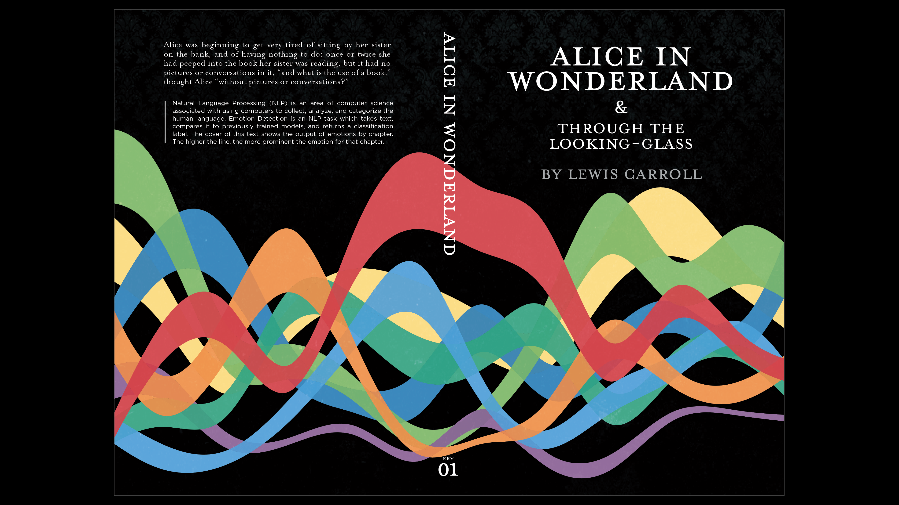
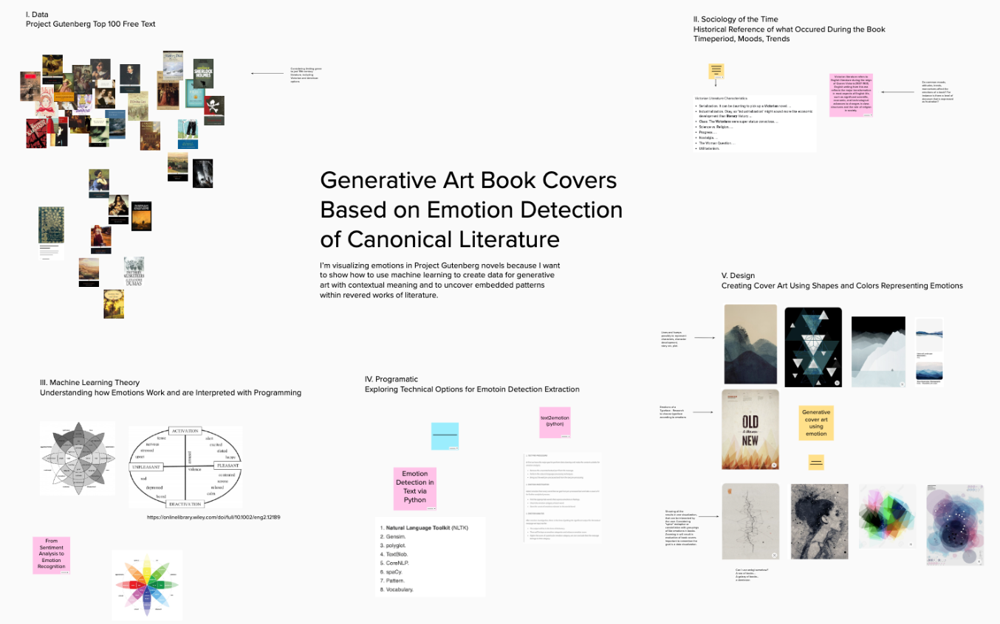

# Generating Book Cover Art Using Emotion Detected Labels in Classical Literature

## Deriving patterns from the emotional landcape of literary texts between 1800-1920

I’m visualizing emotions in Project Gutenberg novels because I want to show how to use machine learning to create data for generative art with contextual meaning and to uncover embedded patterns within revered works of literature. 

I. **Data** 
    &nbsp;&nbsp;A. Project Gutenberg 
    &nbsp;&nbsp;B. Selection Process 
    &nbsp;&nbsp;C. Data Collection 
    &nbsp;&nbsp;D. Data Cleaning  

II. **Sociology of Time Period (may remove)** 
    &nbsp;&nbsp;A. Time Range of Publications (1800-1900?) 
    &nbsp;&nbsp;B. Cultural/Political Happenings 
    &nbsp;&nbsp;C. Moods - Effect on Writing 
    &nbsp;&nbsp;D. Trends - Effect on Writing  
    &nbsp;&nbsp;E. Mannerism - Effect on Writing  

III. **Machine Learning Theory: Emotion Detection** 
    &nbsp;&nbsp;A. Sentiment Analysis 
    &nbsp;&nbsp;B. Emotion Detection 
    &nbsp;&nbsp;C. Emotions/Psychology 
    &nbsp;&nbsp;D. ML NLP Efforts and Research  

IV. **Data Extraction** 
    &nbsp;&nbsp;A. Training the Model 
    &nbsp;&nbsp;B. Program Used 
    &nbsp;&nbsp;C. Procedure 
    &nbsp;&nbsp;D. Problems/Resolutions 
    &nbsp;&nbsp;E. Results  

V. **Design** 
    &nbsp;&nbsp;A. Purpose/Manifesto 
    &nbsp;&nbsp;B. Design Choices 
        &nbsp;&nbsp;&nbsp;&nbsp;i. Shape/Line 
        &nbsp;&nbsp;&nbsp;&nbsp;ii. Color Useage 
        &nbsp;&nbsp;&nbsp;&nbsp;iii. Typography 
        &nbsp;&nbsp;&nbsp;&nbsp;iv. Layout 
    &nbsp;&nbsp;D. Themes/Motifs 
    &nbsp;&nbsp;E. Global Connections  
    
