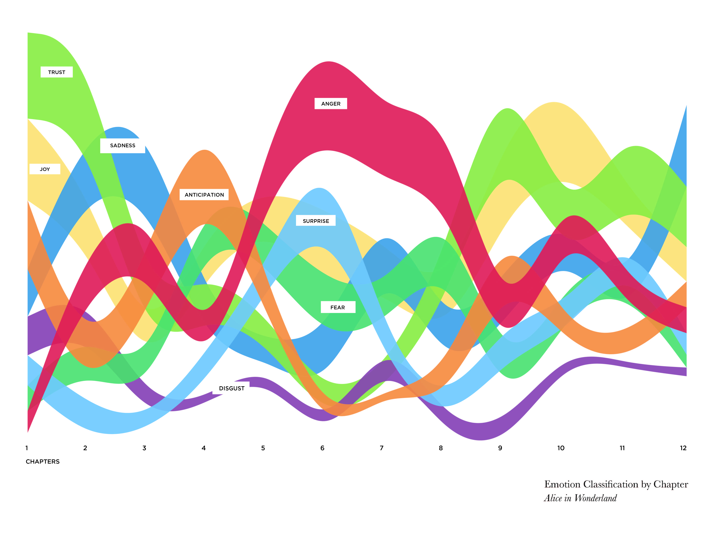
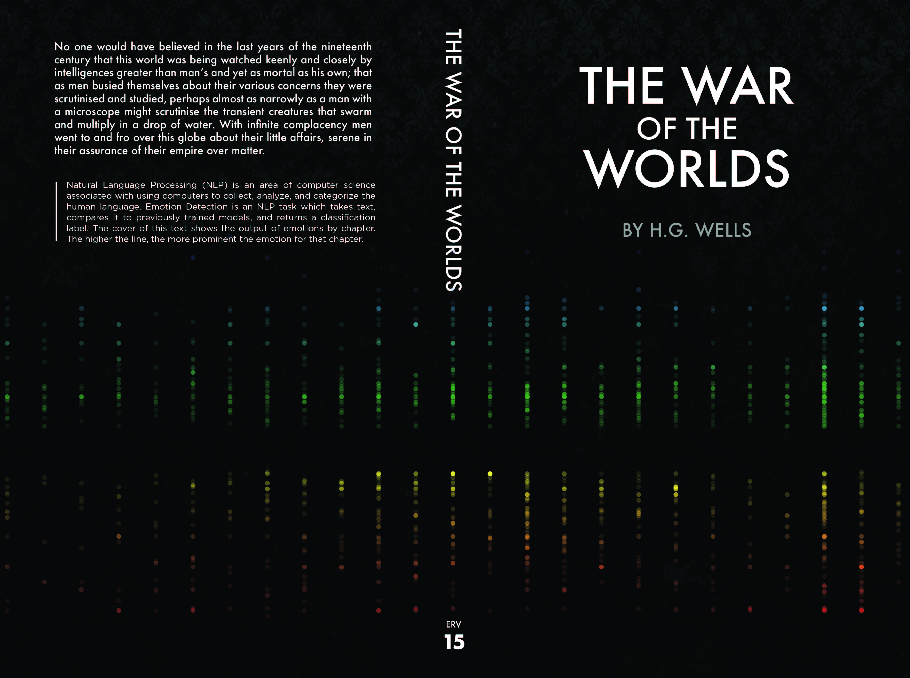
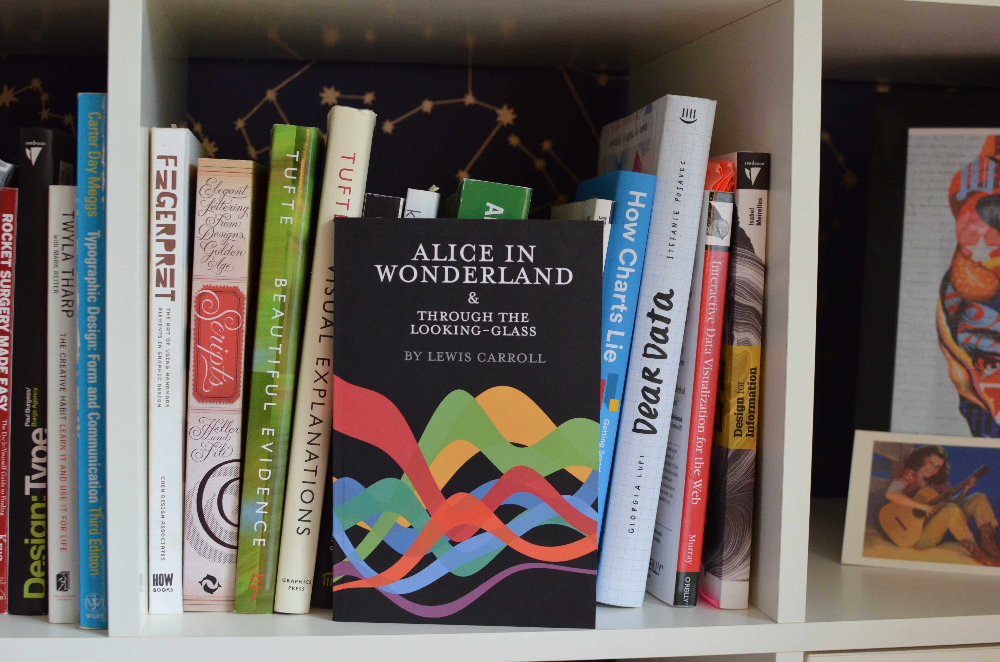

# Emotion Driven Literary Bindings

## Generating Book Cover Art Using Emotion Detected Labels in Classical Literature

### URL
https://tiffanyfrance.com/ml-books/ 

### Abstract
This thesis uses machine learning emotion classification processes in order to create emotionally representative book covers. Both proprietary and hand crafted APIs are used to analyze the corpuses of 26 Project Gutenberg novels. Multiple emotion recognition models are evaluated for accuracy and quality of output. Results indicate that machine learning models are able to adequately predict the emotions in novels and generate supporting data which can be visualized into book cover art.

The final outcome of this project will be printable manuscripts with custom generated covers. The visualizations are built using D3js and data storytelling techniques. The charts will be imported into InDesign for final production and typesetting. In order to avoid copyright issues, all books used are in the public domain, with original publish dates between 1800 and 1925. The physical book will contain the text of the original author, as well as accompanying text and diagrams provided from this project.

### Preview

### Acknowledgements 
Thank you to my partner and my two daughters for your continued support.

Thank you to Project Gutenberg for their noble mission to disseminate 
literary works of art for free consumption.

Thank you to my fellow classmates at Parson's School of Design. It 
was a honor to get to know you and share this experience together.