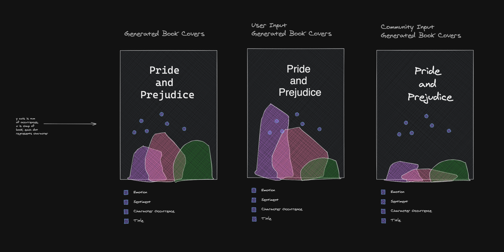

# Documentation

## Wires

Slideable area showing books with titles, revealing 
generated images when sliding from the right. 
 

Top 100 books laid out in three sections: Positive, Neutral, Negative
 

Allowing user to change chapter by chapter sentiment analysis 
for sections provided.
 

Top 100 books laid out on y axis by sentiment, x axis by date published. Also featuring timeline of notable events to see if this affect sentiment.
 

Emotion Detection - there will a transition from sentimenet to emotion. This will show the books divided by emotions.
 

Allow users to change output based on their interpretation of the sentiment of the chapter.
 

Generated book covers based on traned model, user input, community input.

